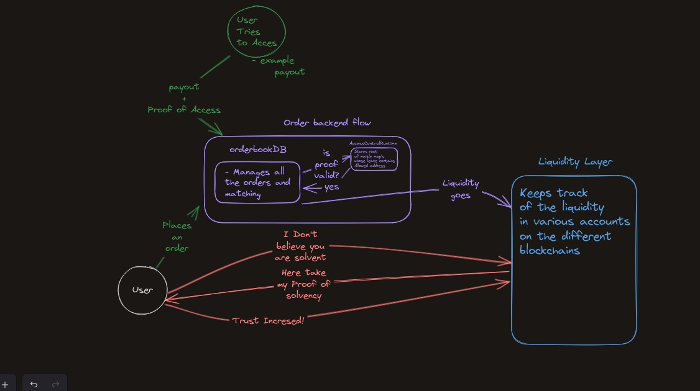
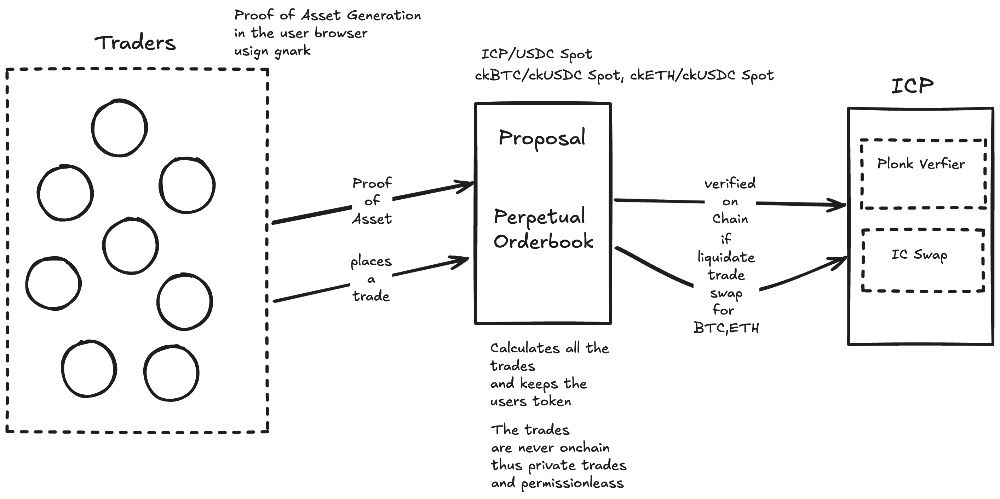

# WELCOME TO PriviTrade

 [Pitch Deck](https://tome.app/some-e06/privitrade-pitch-deck-cm6y6lsbp0du112iin1rpu1cv)  

## $60+ Trillion Dollar Market Overview

The cumulative trading volume of perpetual contracts since 2020 has exceeded $60 trillion, surpassing the trading volume of both underlying cryptocurrencies and conventional futures contracts.

### Problems in Perpetual Markets

#### Open Order Books: Challenges

1. **Front Running:** Visible pending orders allow traders to manipulate transaction ordering to their advantage.
2. **Copy Trading Exploitation:** Competitors can duplicate visible strategies, profiting unfairly from others' trades.
3. **Lack of Privacy:** Exposure of traders' strategies and positions can be exploited by market analysts and competitors.
4. **Market Manipulation:** The transparency of open order books can be abused to manipulate markets and liquidity.

#### Private Order Books: Challenges

1. **Trust Deficit:** Users can't verify platform solvency, raising concerns about asset backing for open positions.
2. **Hidden Liquidity:** Lack of visibility into market depth makes order execution uncertain.
3. **Manipulation Risk:** Market can be manipulated by the platform or privileged users without detection.
4. **User Trust:** Lack of transparency, especially during volatility, can drive users away.

## PriviTrade: The Solution

PriviTrade is a next-generation perpetual trading platform designed to tackle the privacy, trust, and efficiency challenges in existing perpetual markets.

### Key Features

1. **Private Order Book:** Trades are conducted privately without exposing the order book to public scrutiny, ensuring confidentiality.
2. **Proof of Asset Generation:** Using zkSNARKs (powered by gnark), traders generate cryptographic proofs directly in their browsers to verify asset holdings.
3. **Perpetual Order Matching:** PriviTrade maintains off-chain order books and ensures secure trade settlement through decentralized mechanisms.
4. **Plonk Verifier Integration:** Proofs of solvency and trade validity are verified on-chain via Internet Computer Protocol (ICP), enhancing transparency without compromising privacy.
5. **Permissionless Operations:** No centralized authority controls the trade process, enabling unrestricted participation.

### How It Works

1. **Trade Initialization:**
   - Traders generate cryptographic proofs of assets directly in their browsers using gnark.
2. **Order Placement:**
   - Traders place orders in the perpetual order book, which resides on Calimero for efficient and private storage.
3. **Proposal Matching:**
   - The platform calculates trades and ensures the users' tokens are secure. Trades remain off-chain for enhanced privacy.
4. **Proof Verification:**
   - ICP verifies trade solvency through Plonk Verifier, ensuring that if liquidation is necessary, assets are swapped appropriately for BTC, ETH, or stablecoins.
5. **Liquidation & Settlement:**
   - If required, trades are settled through IC Swap, leveraging verified on-chain processes.

### Benefits

1. **Enhanced Privacy:** By storing order book data off-chain and leveraging zkSNARKs, traders maintain the confidentiality of their strategies.
2. **Trustless Verification:** On-chain proof verification ensures platform solvency without requiring trust in a centralized entity.
3. **Market Efficiency:** Private order books eliminate front-running, copy trading, and other forms of market manipulation.
4. **Permissionless Trading:** Decentralized and borderless trading opportunities for anyone with access to the platform.

PriviTrade redefines the perpetuals trading landscape by offering a secure, private, and transparent solution that protects traders and boosts market integrity.
